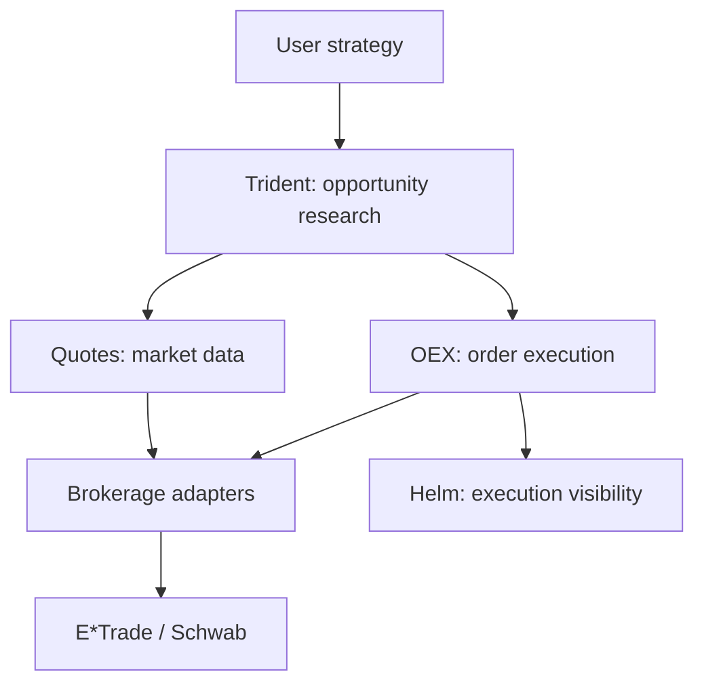

# TradeBot

TradeBot is an open-source Python platform for researching and executing systematic equity and options strategies across multiple retail brokerages. It provides common abstractions for market data, portfolio state, and order management so that strategy and execution logic can operate independently of brokerage-specific APIs.

The platform includes services for retrieving quotes and option chains, identifying trading opportunities, constructing strategy candidates, submitting and managing orders, and surfacing execution state. Current development focuses on E\*Trade and Schwab integrations, with an architecture designed to support additional brokerages.

> **Project status:** TradeBot is under active development and should be treated as experimental software. It is not investment advice and should not be used to place live orders without independent review, testing, and appropriate safeguards.

## Key capabilities

- Common models for equities, options, orders, accounts, portfolios, and brokerage responses
- Brokerage-independent interfaces for quotes, portfolio state, and order workflows
- Equity quotes and option-chain retrieval
- Strategy research components, including calendar-spread construction and same-day-expiry analysis
- Order preview, submission, cancellation, and status retrieval
- Managed execution workers that monitor working orders and apply configurable execution tactics
- Incremental limit-price adjustment for eligible orders
- REST services and a Python client for programmatic access
- Unit, component, and brokerage integration tests
- Installable Python packages for the core platform and quickstart workflows

## Architecture

TradeBot is organized into modular services with shared financial models and brokerage adapters.



### Trident

The Trade Identifier Service scans market data using user-supplied research or strategy logic. Its components include option analysis and construction of candidate trades such as calendar spreads.

### Quotes

The Quote Service retrieves live equity and options market data through brokerage-specific adapters while exposing common request and response models to downstream code.

### OEX

The Order Executor Service supports order preview, placement, cancellation, status retrieval, and managed execution. Execution tactics can monitor working orders and adjust limit prices according to configurable rules.

### Helm

Helm is the visibility layer for surfacing the state of trading strategies, orders, and managed executions.

### Common

Shared modules define financial instruments, brokerage interfaces, serialized API models, service primitives, and reusable connectivity logic.

## Brokerage support

Brokerage capabilities are evolving and may not be uniform across integrations.

| Brokerage | Market data | Portfolio/account data | Order workflows | Status |
| --- | --- | --- | --- | --- |
| E\*Trade | Implemented | Implemented | Implemented | Primary integration |
| Schwab | In development | In development | In development | Adapter scaffold |
| Interactive Brokers (IBKR) | Planned | Planned | Planned | Roadmap |

Before relying on a capability, review the relevant adapter and tests in the repository. Broker APIs and authentication requirements can change independently of TradeBot.

## Installation

TradeBot requires Python 3.14.

Install the core package:

```bash
pip install fianchetto-tradebot
```

Install the quickstart package:

```bash
pip install fianchetto-tradebot-quickstart
```

## Basic usage

The Python client and service modules provide programmatic access to brokerage, quote, portfolio, and order functionality. Brokerage credentials and configuration are required before making authenticated requests.

```python
from fianchetto_tradebot.client.client import Client
from fianchetto_tradebot.common_models.brokerage.brokerage import Brokerage

# Connect to locally running TradeBot services using the E*Trade adapter.
# See the developer setup and brokerage configuration guides before use.
client = Client(Brokerage.ETRADE)
accounts = client.get_accounts()
```

For local environment setup and brokerage configuration, see:

- [`dev_get_started_guides/set_up_local_env.MD`](dev_get_started_guides/set_up_local_env.MD)
- [`dev_get_started_guides/exchange_setup.MD`](dev_get_started_guides/exchange_setup.MD)
- [`docs/serialization.md`](docs/serialization.md)

> The client API is evolving. Consult the source and tests for the current constructor and supported operations.

## Development

Clone the repository and install the package with development dependencies:

```bash
git clone https://github.com/fianchetto-labs/tradebot.git
cd tradebot
python -m venv .venv
source .venv/bin/activate
pip install -e ".[dev]"
```

Run the test suite:

```bash
python -m nox -s unit
```

For focused debugging, direct pytest remains useful:

```bash
python -m pytest tests/common/test_chain.py
```

See [`docs/testing.md`](docs/testing.md) for the test pyramid, Docker-backed
test commands, and live brokerage safety gates. Brokerage integration tests
require separate credentials and configuration. Do not commit access tokens,
private keys, account identifiers, or other secrets.

## Contributing

Contributions are welcome. Useful areas include:

- Additional brokerage adapters
- Market-data normalization
- Execution tactics and risk controls
- Strategy research components
- Test coverage and brokerage simulators
- Documentation and reproducible local development

Before opening a pull request, add or update tests for behavioral changes and clearly identify any brokerage-specific assumptions.

## Safety and liability

Trading software can lose money through software defects, stale or incorrect market data, unexpected brokerage behavior, partial fills, rejected orders, network failures, or flawed strategy assumptions.

TradeBot makes no guarantees, express or implied, regarding correctness, safety, profitability, availability, or fitness for any purpose. Users and contributors are responsible for independently reviewing and testing the software and for complying with all applicable brokerage agreements, exchange rules, and laws. Use of this project is entirely at the user's own risk.

## License

TradeBot is licensed under the [GNU Affero General Public License v3.0](LICENSE).
